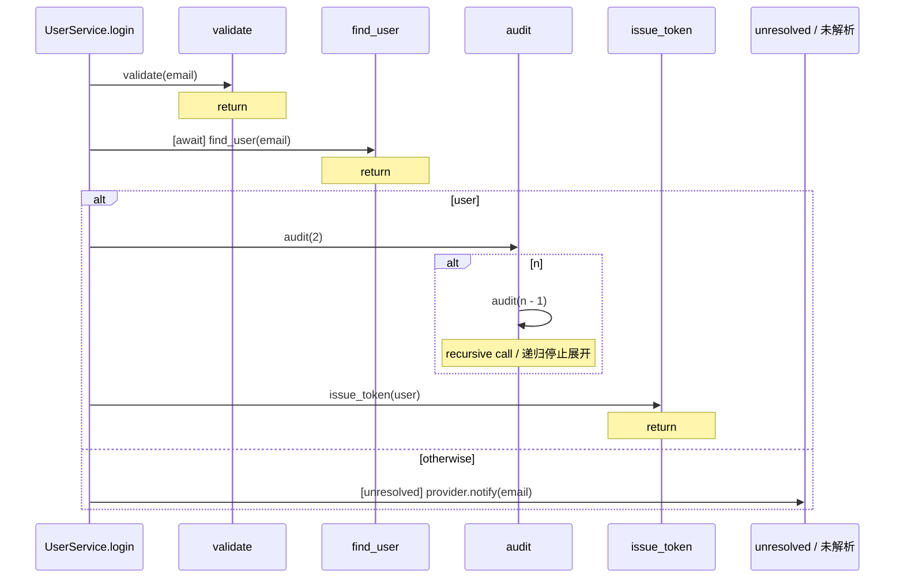

# CallTrace

### Static sequence diagrams with source evidence and visible unknowns

**Follow calls from a selected function and generate Mermaid diagrams with source locations, control flow, and unresolved targets—without executing the project or using an LLM.**

**从选定函数出发梳理调用关系，生成带源码位置、控制流和未解析目标的 Mermaid 时序图，无需执行项目或调用大模型。**

[English](README.en.md) | 简体中文

[安装](#安装) · [CLI 用法](#cli) · [支持范围](docs/support.md)

图由 Tree-sitter 解析、符号解析和有界展开生成，呈现静态结构。

```bash
# 安装后，在 examples/python 目录运行
calltrace sequence . --entry 'UserService.login' --depth 4
```

也可从本仓库根目录运行：

```bash
calltrace sequence examples/python --entry UserService.login --depth 4
```

以下是该命令生成的 `examples/python/.calltrace/UserService.login/sequence.mmd` 内容，包含异步等待、分支、递归边界和无法确定目标的调用：



`provider.notify(email)` 没有可证明的接收者类型，因此保留为 `unresolved`。`exact` 表示支持的静态规则下唯一绑定，不保证运行时不会被替换，也不表示这条路径一定执行。

## 安装

需要 Python 3.11 或更新版本。建议在仓库自己的虚拟环境安装，避免改变其它项目依赖。

```bash
python -m venv .venv
# macOS / Linux
source .venv/bin/activate
python -m pip install -e '.[dev]'
```

Windows PowerShell 无需激活脚本也可安装和运行：

```powershell
python -m venv .venv
.\.venv\Scripts\python.exe -m pip install -e '.[dev]'
.\.venv\Scripts\python.exe -m calltrace sequence examples/python --entry UserService.login --depth 4
```

运行 CLI 不需要 Node.js、LLM API、数据库或目标项目的运行环境。安装 Python 包需要获取已锁定版本的 Tree-sitter 依赖；分析过程读取源码，不导入或执行目标项目、不运行其构建脚本。

## CLI

```text
calltrace sequence PROJECT --entry ENTRY [--depth N] [--output DIRECTORY]
calltrace trace    PROJECT --entry ENTRY [--depth N] [--output DIRECTORY]
```

`trace` 当前是 `sequence` 的同义命令，生成相同产物。也可以使用 `python -m calltrace`。

| 参数 | 含义 |
| --- | --- |
| `PROJECT` | 已存在的源码目录；导入解析以此为项目边界 |
| `--entry` | 必填，函数名、限定名、`文件::限定名` 或完整 symbol ID |
| `--depth` | 默认 `3`，非负整数；入口为第 0 层，`0` 不展开入口体，`1` 展示直接调用 |
| `--output` | 产物目录；相对路径以当前工作目录为基准 |

默认写到 `PROJECT/.calltrace/<入口限定名>/`。文件名中的特殊字符会替换；同名入口会附加符号 ID 的短哈希以避免碰撞。指定 `--output` 后会写入该目录的五个固定名称文件，已有同名产物会被覆盖。

```bash
# 指定源码位置，消除跨文件同名入口歧义
calltrace trace examples/python --entry 'auth.py::UserService.login' --depth 2 --output artifacts/login
```

入口不存在或有多个候选时，CLI 拒绝任意选取；歧义错误会列出带文件、行号的完整 symbol ID，使用该 ID 重试。Java 重载入口可能需要包含参数类型的完整 ID。

| 产物 | 用途 |
| --- | --- |
| `sequence.mmd` | Mermaid `sequenceDiagram`，可放入支持 Mermaid 的 Markdown 查看 |
| `sequence.json` | 时序 IR：参与者、调用、分支、循环、条件保护及展开边界；渲染器唯一输入 |
| `callgraph.json` | 入口深度范围内的符号和唯一调用点，带源码位置、解析规则、候选与状态；同时包含项目扫描诊断 |
| `unresolved.json` | 本次展开所见的未解析调用、原因和候选，不是全项目所有盲区清单 |
| `report.md` | 解析统计、未解析调用、递归/深度边界及项目诊断 |

终端同时显示缩进调用树、解析状态计数和 Mermaid 路径。三个 JSON 的 `schema_version` 当前为 `0.1`；文件位置是相对项目根的 `/` 分隔路径，支持中文文件名。Mermaid 使用 `p0` 等 ASCII 参与者 ID，源码名称作为转义后的标签。

| 退出码 | 含义 |
| --- | --- |
| `0` | 产物已生成且没有项目解析/读取诊断；仍可能有未解析调用或深度边界 |
| `1` | 存在项目诊断，或发生 I/O 错误；有诊断时可生成标记不完整的图，I/O 错误时不能假定产物完整 |
| `2` | 参数错误、目录无效、入口不存在或歧义 |

## 支持范围

当前适配 Python、JavaScript、TypeScript、Java、Go。支持普通函数/方法、有限跨文件导入和具体局部接收者、嵌套参数调用顺序、条件分支、循环、递归停止与深度限制。`await`、Go 并发和延迟调用带上下文标记，不模拟调度。

解析采用 strict unresolved 策略：不会用全项目同名搜索补边。构造器不展开；Python `self`/`cls`、JavaScript/Java 的 `this` 等动态分派保守保留为未知，实际 JSON 状态为 `unresolved`。Java 重载不进行参数类型推断。匿名符号 ID 依赖源码位置。所有源文件按 UTF-8 读取，包括带其它编码声明的 Python 文件。

本版本不提供完整类型系统、运行时跟踪、框架路由/依赖注入推断、任意回调传播或完整异常控制流分析。语法被接受不代表其全部语义被建模。具体语言矩阵、导入边界和 IR 语义见 [支持范围](docs/support.md)。

## 示例与构建

在上述隔离虚拟环境中，从仓库根目录执行：

```bash
calltrace sequence examples/python --entry UserService.login --depth 4
npm ci
npm run validate:mermaid
python -m build
```

渲染示例（Mermaid CLI 使用独立无头浏览器）：

```bash
calltrace sequence examples/python --entry UserService.login --depth 4
npx --no-install mmdc -i examples/python/.calltrace/UserService.login/sequence.mmd -o examples/python/.calltrace/UserService.login/sequence.svg
```

如果开发环境阻止 Puppeteer 下载浏览器，可设置 `PUPPETEER_SKIP_DOWNLOAD=true` 安装 npm 依赖，并用 `PUPPETEER_EXECUTABLE_PATH` 指向已有 Chrome；仅语法验证不需要启动浏览器。

Windows 未激活环境时，将 `python` 换为 `.\.venv\Scripts\python.exe`。第一条命令生成示例图，随后 npm 命令用固定版本的 Mermaid 官方解析器校验语法；该命令在没有图时会失败，不会把空检查报告为成功。Node.js/npm 仅用于这一步演示验证，Python CLI 不依赖它们。

`.venv/`、`node_modules/`、`.calltrace/` 和 `artifacts/` 均是本地环境或生成产物，已列入忽略规则。图能通过语法校验不表示支持矩阵外的语义已得到证明。

## 设计来源与许可证

七个参考项目的固定提交、许可证核验和借鉴边界见 [上游审查](docs/upstream-review.md)。本项目独立实现，无这些项目的代码或 skill 文本复用。CallTrace 采用 [MIT](LICENSE)；Tree-sitter 和各语言 grammar 依赖保留各自授权。
